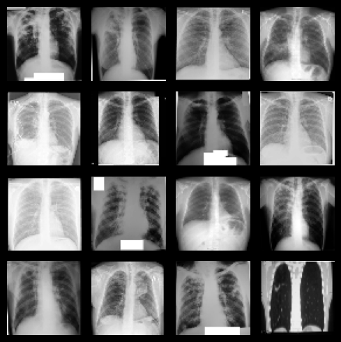
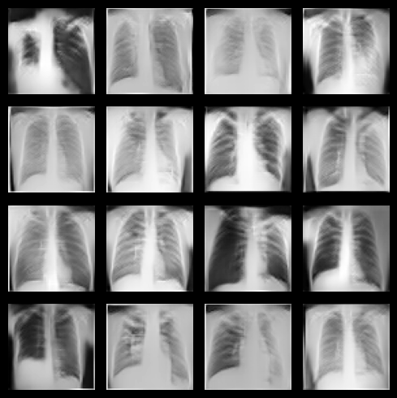

## Overview

This project is about building a streamlit app to integrate a trained Generator from a GAN to generate realistic images of a Medical Dataset of Tuberculosis, a minority class in the X ray-Chest Dataset.

In the field of medical imaging, certain conditions or diagnoses are underrepresented in available datasets.
This leads to challenges in developing robust models for these minority classes.
The importance of balanced datasets in training machine learning models, especially in healthcare applications, cannot be overstated.
This project aims to address the scarcity of medical images for a specific minority class, 'Diagnosed with Tuberculosis,' by leveraging the power of Deep Convolutional Generative Adversarial Networks (DCGANs).

* You can view the full code for training the GAN & Processing the Images here:
<a href="https://github.com/Hypatchia/DatasetAugmentation-GenerativeNetworks-KerasTensorflow">https://github.com/Hypatchia/DatasetAugmentation-GenerativeNetworks-KerasTensorflow</a>
* You can Generate Any Number of Images from the Tuberculosis Class by using the streamlit app on this link:
<a href="https://datasetgeneration.streamlit.app/">https://datasetgeneration.streamlit.app/</a>

* All you have to do set a number of images to generate and click a button to generate in real time & download a zip file of the images you created.

## Built with

## Image Dataset Augmentation using GANs

By leveraging the capabilities of GANs, our augmentation technique is now able to generate synthetic images seamlessly integrated with the original dataset.
The objective is to broaden the project and offer the ability to try the generator to generate any number of images a user wants.
The integration of GAN-based augmentation is poised to elevate model performance and adaptability.

Explore the Dataset Augmentation Repository here  to delve into the full implementation of the Deep Convolutional Generative Adversarial Network.

  

    <h4>Images from a batch of the Original Dataset</h4>
    
  

  

    <h4>Images from a batch of the Generated Dataset</h4>
    
  

## Project Scope
- Develop a DCGAN using TensorFlow and Keras for generating synthetic medical images.
- Achieve high quality of Generated images by training an accurate Generator using Adversarial training.
- Augment the original medical dataset by creating more than 2800 images  to address the imbalance in Tuberculosis class compared to Normal class.
- Ensure Increased diversity in the dataset for the 'Diagnosed' class,
- Build a Streamlit app to enable the real time generation of images of the Tuberculosis Class by entering a number of images

## Steps to run 

* Always Create a Virtual Environment (I am watching u, do it)
~~~
python -m venv "name of env"
~~~
* Activate environement
~~~
Source path to /Scripts/activate
~~~
* Install requirements.txt in environment
~~~
pip install -r requirements.txt
~~~

* Run streamlit app
~~~
streamlit run app.py
~~~

## Contact
 Feel free to reach out to me on LinkedIn or through email & don't forget to visit my portfolio.
 

